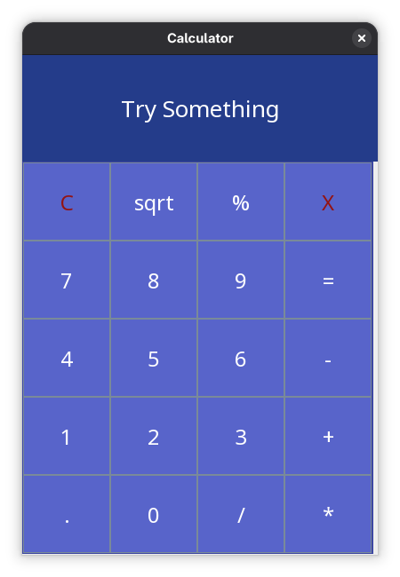

# Java Swing Calculator

A simple desktop calculator application built with Java Swing.

## Overview

Java Swing Calculator is a lightweight desktop application for performing basic mathematical calculations through a graphical user interface.

The project was originally developed as a personal Java programming project.

The implemented calculator functionality is complete and focused on basic arithmetic operations. More advanced features were considered for future development but are not part of the current version.

## Screenshot



## Features

* Addition
* Subtraction
* Multiplication
* Division
* Modulo
* Decimal number input
* Square root
* Clear
* Backspace
* Graphical user interface

## Technologies

* Java 21
* Java Swing
* Apache Maven

## Requirements

* JDK 21 or later
* Apache Maven

## Getting Started

### Clone the repository

```bash
git clone https://github.com/MostafaNasrollahpour/java-swing-calculator.git
cd java-swing-calculator
```

### Build the project

```bash
mvn clean package
```

### Run the application

Run the `Startup` class from your IDE.

## Project Status

The current version is a complete basic calculator.

The project is not actively maintained. More advanced calculator features may be added in the future.

## License

This project is licensed under the MIT License. See the [LICENSE](LICENSE) file for details.
